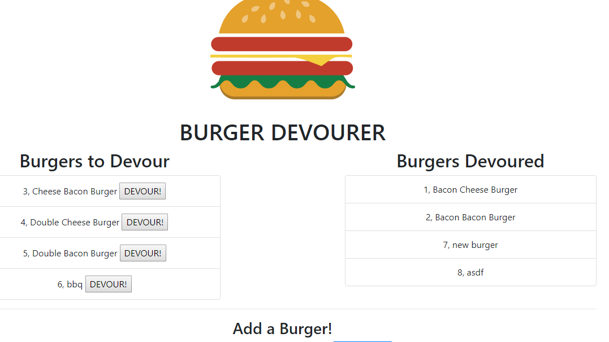
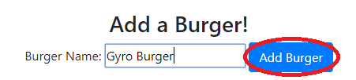
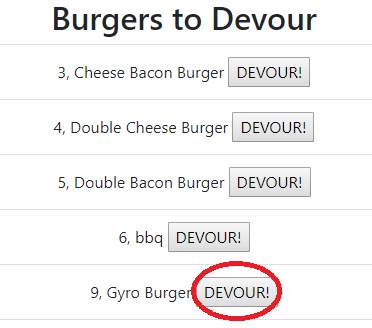
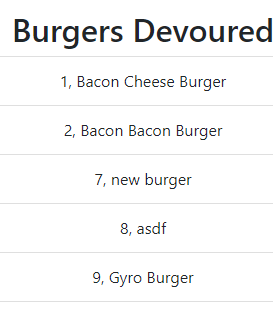

# Burger Devourer
In this web application, you can create a 'burger', putting it in the left 
"Burgers to Devour" list. When the burger is devoured, by pressing the 'devour' button,
it is moved to the right list of "Burgers Devoured".

This is the step-by-step instruction on using this app.

1. Visit Localhost:3000. You will be directed to the main page! *heroku link currently broken

2. To add a burger, type in the name in the bottom field, and click on the 'Add Burger' button.

3. Once added, you can click on the 'devour' button to eat it!

4. You can see that 'Gyro Burger' is now moved to the right!

